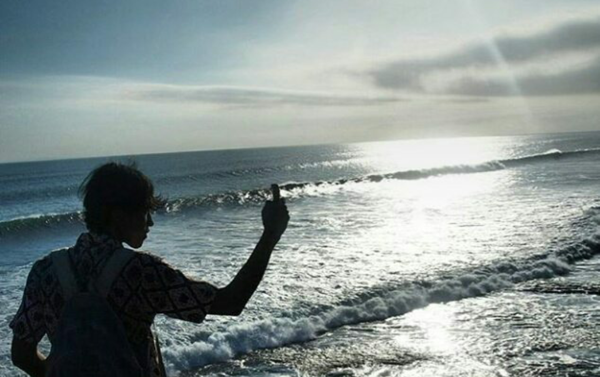

rencana sudah matang, berdiri di tepi lautan.

iman terhunus, siap sambut Leviathan. ia menyerang, aku menyerang, menusuk jiwa dan anak tekak. maka matilah semua kecemburuan. itu bangkainya mengambang pelan, bau.

lalu dengung serangga terdengar. Beelzebub datang kelaparan. jasad itu dilahap kalap, rakus bak tikus politikus. penuh keyakinan, berseru ku. lalat terkejut, terbang memburai ketakutan.

kulanjutkan dengan menyelam, menuju palung terdalam. Memasuki goa, penuh gairah aura merah. Asmodeus melenguh, sibuk entoti jiwa-jiwa pasrah. dengan kesadaran penuh, ku kebiri binatang itu. biar jera.

menyusuri goa, berujung singgasana. duduk di atas takhta, Mammon si hedon. tak henti merenggut harta dari orang sengsara. itu harta kuambil, kutebar ke para papa. maka iblis itu menciut, tak punya apa apa.

terdengar deru amarah dari Amon yang kehilangan saudaranya. kuhindari semua desing panah, lalu kuurapi wajah bajingan itu, yang langsung mati terbakar.

gerbang utama terlihat jelas, dijaga penjaga malas. Belphegor meringkuk di dalam tempurungnya, tidak peduli akan tugasnya. kunyalakan api kepercayaan, kusulut karapaks itu. maka ia terjaga, terbirit-birit mencari pertolongan.

di dalam ruangan besar, bercahaya. Azazel yang penuh talenta, tapi hubris menguasainya. kuajak ia untuk sadar, menjadi pribadi berguna. sial, pertarungan tak terelakkan. ia melawan dengan penuh kuasa. "aku setara, bahkan lebih berkuasa!". kulempar biji sesawi, menghantam jiwanya.

 

sirna.
maka terbitlah Kebajikan.

—15 Juni, 3 hari setelah ulang tahun, akhirnya sadar bahwa ulang tahun tidak mengulang event indah di tahun sebelumnya—