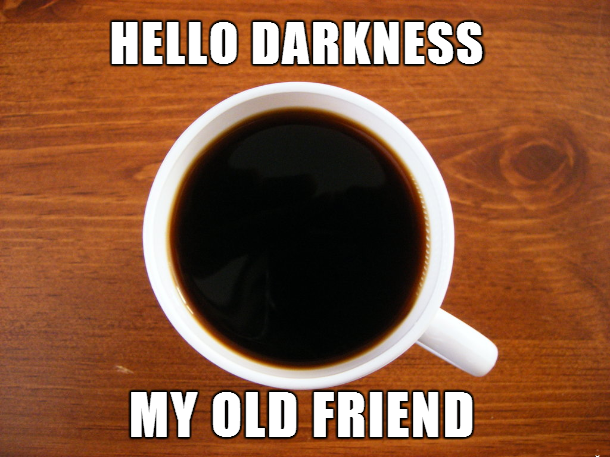

“Gua ngantuk nih,” lalu teman gua beranjak ke dapur membuat kopi tepung[baca: kopi kopian kemasan tinggal sobek yang lebih banyak kadar gula dan krimer daripada ekstrak kopinya]. Dia selesai membuat kopi itu dan kembali duduk. Menyeruputnya sedikit.

“Terus lo berasa ga ngantuk abis nyeruput itu?” “Iya, nih gua jadi seger,” oke. Kopi —bahkan kopi kemasan yang kadang tidak mengandung kopi sama sekali— memang sudah dikaitkan dengan penangkal kantuk oleh lebih banyak orang. Tapi, menurut gua, bukan kopi yang membuat lo jadi seger saat merasa ngantuk.

Bergerak. Itu yang membuat lu jadi tidak mengantuk lagi. Ketika lu duduk, atau tengkurap sambil mengerjakan tugas dan sudah terlalu lama mengerjakannya, lu bakal suntuk, dan berlanjut jadi kantuk. Lalu lu membuat kopi, dengan tujuan mengusir kantuk dengan kopi. Tapi sadarkah elu? Bahwa sebelum itu kopi elu seruput, bahkan sebelum elu selesai membuat kopi, badan lu sudah merasa segar?

Yoi, bukan kafein yang bikin ngantuk lu hilang, tapi proses lu bangkit, berjalan ke dapur, dan membuat kopi yang membuat ngantuk lu hilang.

Hal ini bisa diterapkan jika di ruang kelas lu mengantuk, gak mungkin kan, lu bikin kopi di kantin lalu dibawa ke kelas? Solusinya mudah, izin aja ke kamar mandi. Tidak usah cuci muka, berjalan saja ke kamar mandi, mungkin ditambah peregangan —stretching— singkat. Lalu lu akan jadi segar, dan siap ke kelas lagi untuk belajar. Atau bisa lebih mudah cabut pelajaran. HAHA.

eniwei, bagi lu yang bersikeras bahwa kopi adalah faktor yang membuat kita tidak mengantuk, dan merasa kafein bermanfaat sebagai power shot bila pekerjaan rumah(baik itu Quest in-Game, Proyek, Chat dengan pacar, atau merakit Gundam) banyak tetapi mengantuk, well gua mengucapkan selamat. Karena lu beruntung, bisa mendapatkan talenta sebagai pemroses kafein yang baik dan benar.

Baiklah, kapan kapan kita akan berbicara soal kenikmatan meminum kopi. 
But now, I must go. For my people need me.
