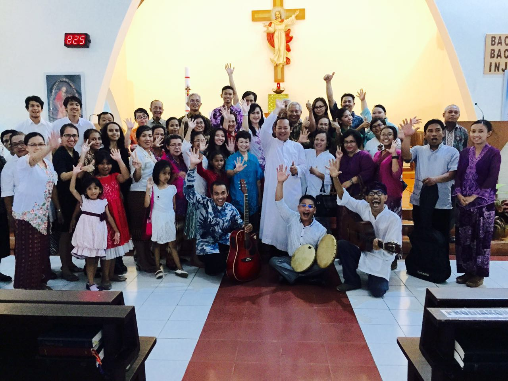

Apakah kalian pernah merasakan kompor tidak seasik nesting?
Bata merah lebih bersih daripada sikat dan pasta gigi?
Menyerut dan mengolah sagu lebih memuaskan daripada masak nasi?
Melayang lebih unik daripada tidur?

Gua merasakan hal itu. Gua merasa bosan.

Belum 12 jam yang lalu gua merasakan titik puncak pencapaian minggu ini. Hasil latihan musik selama hanya 2 minggu, ditampilkan dengan baik, lancar. Nikmat dirasakan para umat, wajah kami merah berseri, semua orang senang. Lalu pulang, makan, chatting, tidur, bangun, nongkrong, kosong. Bahkan pembukaan post ini hambar.

---

Gua pernah menyimpulkan, cara orangtua merawat anak—untuk mencapai anak yang dianggap sukses— adalah grafik lurus dalam bidang biaya dan usaha.
**(a)Tinggi di awal, rendah di akhir.**

**(b)Lurus datar.**

**(c)Rendah di awal, tinggi di akhir.**

**(a)** Orangtua yang memberi modal besar, atau talenta besar kepada anaknya sejak kecil, akan dengan mudah membimbing—atau membiarkan— si anak yang mulai dewasa untuk mencapai hidup sukses. Modal, entah itu susu berkualitas bagus, sekolah mutu tinggi, pendidikan moral-etika dalam rumah, stimulus pemikiran yang baik(dalam ideologi pilihan orang tua, ideologi si anak mungkin berubah), atau bisa dimulai sebelum anak itu lahir, dengan memilih pasangan dengan paras indah dan otak encer.

**(b)** Orangtua yang terus menerus memanjakan anaknya, akan terus mengeluarkan biaya besar sepanjang gendong ayunan si anak di pundak orangtua, dalam kasus ini, kemungkinan gendong itu bertahan seumur hidup. Grafik lurus, bukan berarti usaha yang dikeluarkan adalah tengah-tengah dari (a) dan (c), tapi bergantung dari modal awal (b). Orangtua yang memanjakan anaknya mengeluarkan modal awal besar? Pengeluaran dengan jumlah sama akan berlanjut.

**(c)** Orangtua yang pada awal pertumbuhan anak, abai dan tidak segera memberi modal yang baik, lalu si orangtua sadar dan berusaha membuat anaknya mencapai kesuksesan. Usaha yang dikeluarkan akan sangat besar, berkali lipat dari usaha awal orangtua.

Hasil akhir, mungkin usaha berhasil dan anak menjadi sukses, tentu dengan karakter yang berbeda-beda. Yang satu mandiri, yang lain manja, pemberontak. Aktif, pasif, introvert, ekstrovert, atletis, obesitas, atau hasil produk akhir yang berbeda-beda.

Menurut gua, cara (a) adalah yang terbaik, bisa kamu lihat, grafik rendah di akhir bukanlah tanda kemalasan orangtua, tetapi berkurangnya usaha yang diperlukan orangtua untuk mengurus anak. Anak mengurus dirinya sendiri.

Tentu saja anak yang merasa bosan dengan modal yang dicurahkan orangtuanya bisa jadi keluar dari gaya hidup tersebut, dan membuat hidupnya sendiri dan jalannya menuju sukses. Ada juga anak berbakat, yang dengan mudah menuju kesuksesan bagaimanapun cara orangtua mendidiknya. Hal yang lupa gua tambahkan, tolak ukur sukses akan berbeda bagi orang-orang, tapi secara general, sukses adalah hidup bahagia.

---

Beberapa teman gua terus menanyakan gaya hidup yang gua lakukan, berusaha mencari faktor-x gua bisa menjadi (menurut mereka) tinggi, cepat tanggap, ataupun aktif, atau hal lain yang tidak mereka miliki tapi gua miliki. Merespon hal tersebut, gua menceritakan gaya hidup gua yang biasa saja, sambil berpikir, padahal ada hal yang tidak gua miliki tapi mereka miliki.

Untuk masalah postur tubuh, gua tau genetik berperan besar dalam tinggi, berat badan atau massa otot yang gua miliki. Untuk kemampuan otak dan skill, gua yakin hal tersebut didapat dari hasil gua menekuni hobi. Hobi gua, membaca, mengulik lagu, menggambar, lari, seni. Beberapa hobi gua tekuni dengan sangat, sehingga skill gua dapat dengan cara menyenangkan, sedangkan imitator gua, dengan suntuk dan lelahnya, menjalani kegiatan untuk meraih hal yang gua miliki.

Gua sendiri, dengan suntuknya, menjalani kegiatan olahraga beregu, atau berkomunikasi dengan baik. Karena hal tersebut bukan gairah gua, tapi gua sadar hal tersebut harus dilakukan karena pencapaiannya akan berguna bagi kelangsungan hidup gua. Terutama berbicara dengan baik.

---

Gua mengenal band efek rumah kaca sejak lama, mungkin 2008, masa awal gua menjelajah saluran radio FM. Dimulai dengan "Jatuh Cinta itu Biasa Saja" "Debu-debu Berterbangan" dan "Kenakalan Remaja di Era Informatika".

Sekarang, Sinestesia menjadi suara latar dalam pembuatan post ini. Biar bagaimanapun, "Putih" tetap menjadi lagu favorit dalam album tersebut. Mungkin karena lagu ini merupakan single yang pertama gua dengar dari calon album Sinestesia. Mungkin karena tema kematian yang menjadi intro lagu, dan digarap dengan apik, gelap, mistis.

Tema kematian dalam seni memiliki tempat sendiri dalam hal keseleraan gua. Dalam lagu yang sebelumnya dibahas—"Putih", video klip lagu "November Rain", film "Bridge to Terabithia" dan "Lion King". Tema tersebut gua tafsir sebagai permulaan dalam menjalani hidup. Hal itu tidak berhubungan dengan budaya reinkarnasi, atau takut dalam menghadapi kematian. Tema kematian menjadi pendorong agar gua bisa melampaui keterbatasan yang gua miliki saat itu. Keterbatasan dalam hal kepunyaan, contohnya skill, cara pikir, harta, apapun. Menjadi semacam penyemangat. Orang lain mengartikan hal tersebut sebagai "lakukanlah sebaik mungkin selagi kematian menjelang".

---

Sinestesia sudah tak lagi didendangkan dvd player, dan gua rasa kebosanan gua mulai berkurang sedikit. Saat ini hari Kamis, 5 Mei 2016 jam 23:28, dan gua sedang tidak dalam mood untuk nongkrong, nonton, maupun makan. Gua harus mencari kesibukan yang berguna, karena hari Jumat menjelang.

Dengan sangat, gua berharap kalian tidak merasa bosan.
Sampai Jumpa. До Свидания.