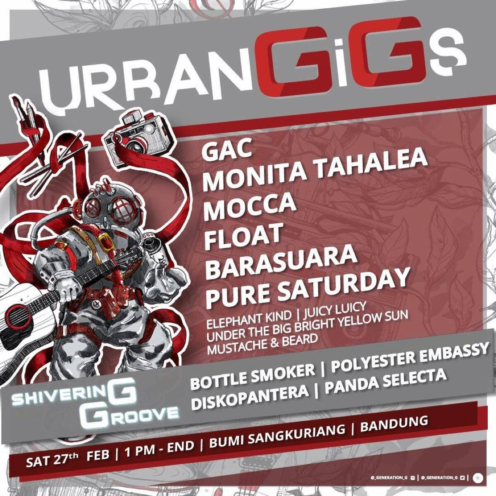

**27 Februari
16.48 —**
Temen gua mengirim poster event urbanGiGs, dengan caption 'pindah ke bandung yuuk'. Kami memang sering nonton konser bareng, dan beberapa saat lalu baru Barasuara. Chat itu memang bernada canda, karena tidak mungkin dia pergi ke Bandung.

Kebetulan, gua baru selesai ngerjain project di kantor, lagi main hape dan melihat poster itu, "ooh, Barasuara, seru nih" "Anjing! ada FLOAT!" yap, pikiran spontan yang muncul ketika melihat band favorit gua itu tampil, dan gua melewatkan kesempatan menonton mereka 2 bulan lalu.

**17.27 —**
Lewat sudah 39 menit dengan gua mencari-cari cara bisa ke Bandung untuk menghadiri event itu; berkoar di grup minta tebengan, memperhitungkan tarif Bus atau Kereta hingga alternatif pesawat! "Gua harus cabut ke Bandung malem ini biar besok tinggal jalan kaki 8km dari stasiun Bandung ke tempat event!"

**19.30 —**
Posisi gua di Bro.do Kemang, fyi itu toko sepatu. Jadi, dalam 2 jam ke belakang, setelah gua pasrah tidak mendapat tiket keberangkatan ke Bandung untuk malam ini, akhirnya berjalan dengan lesu ke parkiran sepeda hendak pulang.
Tiba-tiba tante gua mengajak untuk ketemuan di Pejaten Village, mengajak makan bareng dia dan anaknya yang saat itu sedang les menyanyi di Yamaha. Biasanya rute gua untuk pulang dari kantor di Gandaria8 adalah Radio Dalam > Antasari > Jeruk Purut > Ampera > Cilandak, berhubung perjalanan gua berubah menuju Penvil, bertanyalah gua ke orang sekitar 'pilar flyover 19' mengenai jalan tikus ke sana.
Ternyata, jalan tikus itu mengarah ke Jalan Kemang 8, iya sih, emang bisa ke Penvil juga, tapi syiiiiit the traffic man! Well, kebetulan gua melewati toko Bro.do, sempat lah, mampir sebentar melihat katalog. Akhirnya gua ga beli apapun, dan lanjut gowes ke Penvil.

**21.22 —**
Bersama tante dan anaknya(berarti dia sodara gua, kan?) makan di toko bakso di lantai puncak Penvil, setelah tante gua menceritakan kisahnya 'gagal ke Bandung', gua kembali berniat pergi menonton konser di Bandung itu.

**27 Februari
00.12—**
Masih sibuk mencari cara menuju Bandung, sudah menanyakan tarif dan cara memesan kereta ke teman, dan memutuskan kereta pukul 9 pagi dari Gambir adalah yang terbaik.
Bapak gua tiba-tiba masuk kamar, minta dipijat.
Dari sesi pijat—yang jelas tidak plusplus— itu, gua mendapat alternatif baru menuju Bandung dari bokap: Bis dari Lenteng. Hmm, menarik, tapi ia menutup pembicaraan—dan sesi pijat itu dengan berita lain: besok abang gua yang udah nikah mau main ke rumah bareng istri dan anaknya.

"Oke, dipikir dulu deh pak jadinya ntar gimana"

**12.37 —**
Akhirnya, gua di WM, tempat nongkrong gua, mengetik post ini di hape. Yap, gua gagal dalam rencana menghadiri performa Float, Barasuara(dan band lain yang gak terlalu gua pikirin) di Bandung. Gak apa apa, setidaknya di sini gua masih bisa memutar lagu mereka dari hape. Tetep aja, masih galau atas absennya gua di event itu. Nih posternya btw:

Sisi positifnya, gua gak jadi memakai ~Rp 300ribu tabungan gua untuk perjalanan, dan yang pasti, gua bisa ketemu abang, ipar, dan keponakan gua yang saat ini masih bayi lucu lucu.

---

Agar post curhat ini lebih bermakna, gua tambahkan pesan moral:
Hidup perlu rencana, tapi yang spontan lebih berkesan. Jangan bayar kredit, mending kontan. Karena Roro Jongrang mengakali Bandung Bondowoso, perempuan itu berubah jadi batu. Tumang adalah bapak kandung Sangkuriang, dan alasan orang Indonesia yang tidak akan kenyang tanpa makan nasi sulit diterima nalar gua.

Selamat siang, semoga akhir minggu kalian menyenangkan.