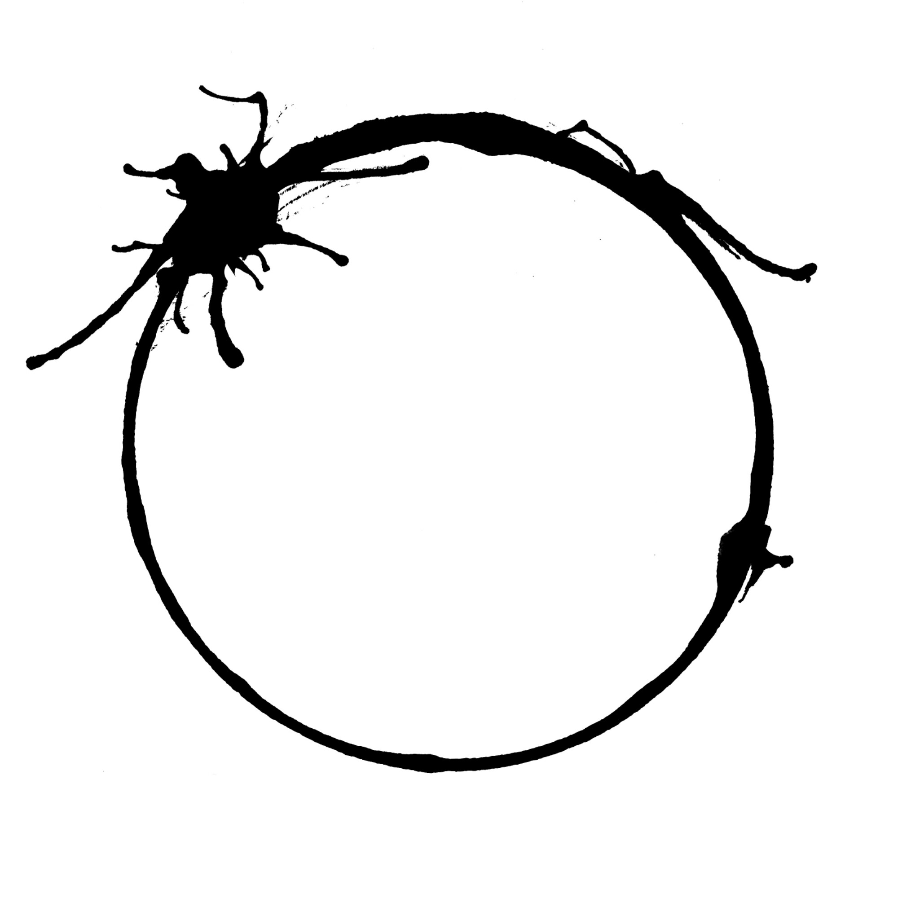

Coklat, Kuning, Merah, Putih, tetap Homo Sapiens. Beda ukuran hidung, mata ataupun penis, tetap satu spesies, lalu menyesuaikan dengan habitat dan kerasnya hidup. Cara berpikir dan harta hanya konsep. Tempat sekolah, berpolitik dan rohani berteguh harusnya tidak menciptakan spesies baru.
Heptapod aja bersedia membantu dan minta bantuan manusia. Masa lu pecah?

 

Ya

 

kan?