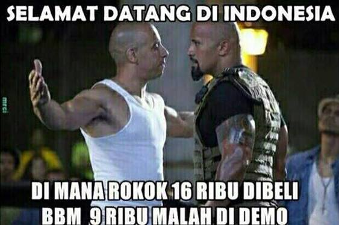
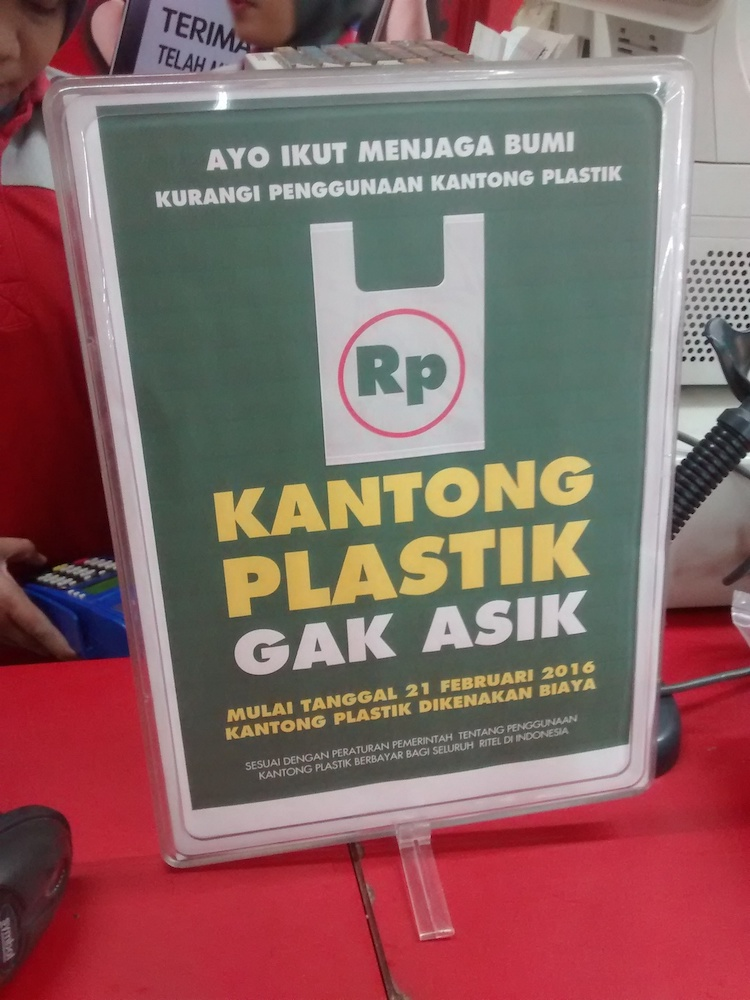

Hola! Buruan jawab: lu milih ditiban besi 100kg, atau kapas 100kg?

Tadi gua baru baca koran Kompas minggu lalu, liat iklan hape, terus langsung ngamen di lapo biar dapet uang buat beli Galaxy Note 5 yang harganya gak masuk akal. Harga segitu gua gamampu, apalagi iPhone 6? Untuk saat ini cuma bisa menggapai-gapai dari kejauhan untuk benda mewah itu. Tapi pas iPhone 10 keluar, gua udah bisa ngeborong kok, tenang aja.

**Serius**, di koran ada berita: plastik kresek(dinamain dari bunyinya) bakal dicatok tarif minimal Rp 200 di kota tertentu, lebih murah daripada di Balikpapan harganya cenggo(tadinya malah goceng).

(Di sini gua akan mengandaikan jika harga plastik yang dicatok retailer sama kaya di Balikpapan, Rp 1500) Mengingat mental orang normal yang protes bensin—jelas bermanfaat buat pacaran, nongkrong, bikin areng pas bakar ayam— sempet naik jadi Rp 9000, gimana kalo benda sepele yang biasa dikasih gratis—kadang malah diminta dobel— dikasih harga? Kebayang gimana reaksi orang yang biasanya cuma beli Royco 2 sachet aja pake minta diplastikin.

"Sampo laifboy 3 dong bang"
"Nih bu, ja—"
"Plastikin dong!"
"Oh iya... Nih bu, jadi tiga rebu"
"Hah?!" *langsung dilariin ke rumah sakit karena zuppa soup yang tadi dimakan doi di nikahan temen sodaranya udah basi*

Logika orang normal, plastik kresek itu sepele. Ringan, tipis, bisa dibuntel jadi kecil. Semua orang dengan mudahnya ngebuang sampah plastik ke jalan, pikirnya gak bakal banyak pengaruh ke lingkungan. Oke, kalo di suatu daerah cuma satu—dua yang berpikir gitu, emang gak berpengaruh banyak. Masalahnya, cara pikir demikian diterapkan oleh **banyak orang**. Berarti yang membuang sampah plastik ke jalan raya adalah **banyak orang** itu. Efeknya(yang gua tau dari koran), adalah setiap harinya, sampah plastik di Balikpapan mencapai 60 ton! GILA! Sama dengan berat Tyranosaurus Rex dikali dua belas!

Sekarang anggaplah berat sampah plastik di kota kalian sama dengan di Balikpapan, atau mungkin lebih berat lagi. Miris kan? Benda yang kalian anggap sepele dan ringan ternyata menyumbang banyak banget sampah.
Ngomongin 'berat', kalian lebih milih mana? Milih ditiban besi 100 kg atau kapas 100 kg?
Gua sih, milih kamu yang sering menemani aku beli buku~

Btw, gaada pilihan yang lebih benar, soalnya belom pernah ada yang praktekkin hal itu. Gua sih berharap kalian mengurangi sampah plastik yang mungkin sering kalian buang, gimanapun caranya. Beli rokok di alfa gausah diplastikin lah, tenteng aja pake tangan. Kalo si kasir terlanjur masukkin belanjaan kalian ke plastik, tolak aja baik-baik.

Udah ah, selamat malam! Jangan lupa cari jodoh! Penampilan dan sifatnya si doi gak penting, yang penting seiman ya!

**Update:**
Barusan gua ke Lotte Mart, udah ada pengumuman ini:

Lalu, seorang pembeli yang antri di depan gua kaget, setelah si kasir ngasih tau kebijakan baru itu. HAHA! Rasakan kau, konsumen primitif!