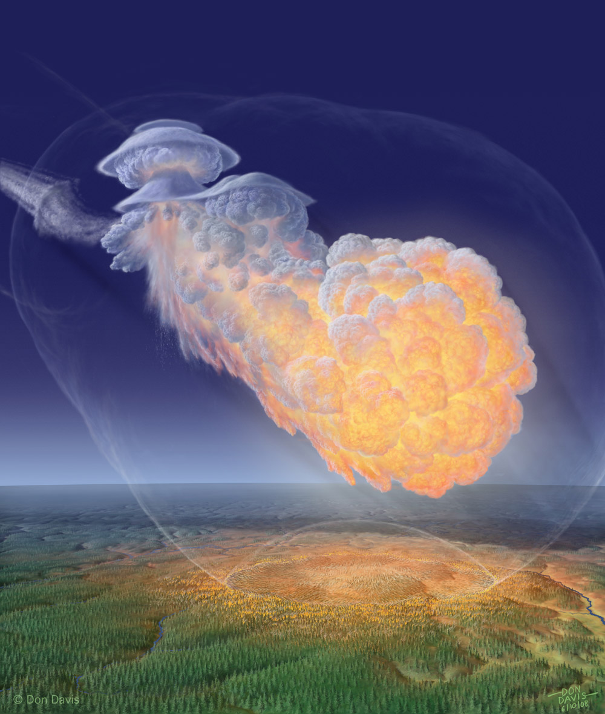

**17 April 2451**, Yogyakarta. Hari bersejarah yang membanggakan bangsa Indonesia! Trio Jenius ilmuwan muda Phoebe Danuvich Kulistyo, Kindrad Bumi, dan Rinaldo Stevan-Mulia berhasil menciptakan mesin waktu, atau lebih tepatnya, memberitakan ciptaan mereka ke publik sebelum dibungkam oleh badan penjaga perdamaian.

**12 Juni 2451**, -------. Perencanaan dan pengamanan matang sudah siap, demonstrasi mesin waktu pada khalayak umum oleh trio jenius akan diadakan di-

**30 Juni 2451**, Cirebon. Tepian pesisir, kaca anti-nuklir 50x30m, 1300 elit pengaman, tiket masuk Rp 30.000.000 per satuan. Tiga ribu pemirsa di amphi-theatre dan 4,2 Miliar dari layar hologram di seluruh dunia.
Kamera lintas-waktu siap, Danu-Kindar-Aldo berjalan tembus portal biru.

**????????**, ekstraDimensi. Steker penanda menunjukkan -543 tahun, sesuai pungutan suara masal di era mereka, trio jenius berjalan lintasi ratusan tahun dan 7500km menuju-

**30 Juni 1908**, Tunguska-Vanavara. Matahari sudah terbit 3 jam, portal jingga terbuka ~140m di atas pepinusan. Kindar mengabadikan lanskap Siberia dengan sel-kamera untuk dokumentasi pribadi. Aldo telah merangkai kamera lintas-waktu, untuk memuaskan hasrat sponsor dan miliaran pemirsa di kampung waktu mereka.
Entah konspirasi pembungkaman yang berhasil atau kesalahan kalkulasi, ketika Danu mengaktifkan kamera lintas-waktu, nyala biru memaksa masuk dari portal jingga.
Itu biru hantam jingga, leleh Danu-Kindar-Aldo seketika menyublim sirna. Lantak membuat 2150km persegi pinus merata. Satu orang slav malang terkena sontak suara yang melempar tubuhnya ke batang pinus, jasadnya remuk, leta.

**+543tahun -2507detik**, Cirebon. Layar raksasa sempat menampilkan lanskap Tunguska-Vanvara, Siberia. Pemirsa pongah terpesona, kerabat trio jenius menangis bangga.
Awalnya pelan tak disadari, lalu portal biru mendadak tilap, ditelan dirinya sendiri. Tampilan layar bergetar tremor, lalu biru, lalu jingga, lalu sirna. Lalu-
