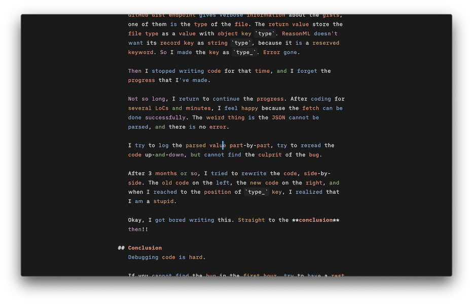
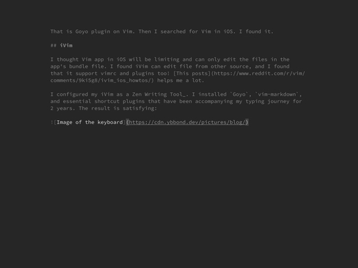
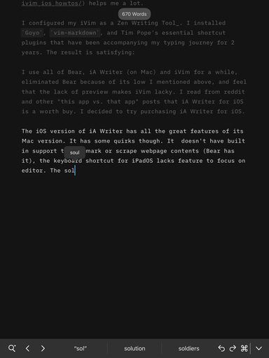

> “Orang emang gak pernah puas!” - Indonesian colloquial sayings
>
> “People are never satisfied” - Paulo Coelho’s almost literal translation

Part 2 of my previous post: [In Search of Good Writing App - Bear vs Ulysses](/posts/2020/03/in-search-of-good-writing-app-bear-vs-ulysses/)

---

In the previous post, I compared [Ulysses](https://ulysses.app/) and [Bear](https://bear.app). I ended up subscribing to Bear. Bear itself is a good writing app, with nice clean interface design, great synchronization between MacOS and iOS (or iPadOS) platform, with a _just right_ MarkDown implementation.

I feel satisfied with my three days of Bear usage. The subscription model does not bother me, but I found several aspect to reconsider:

### Backup
One thing I like from Ulysses is file versioning similar to MacOS's _Time Machine_. Bear lacks that feature, changes I made will replace the previous version of the file in iCloud. The only way to access file history in Bear is through undo. Yep, plain old undo.

### File Storage
Bear store my notes in its own enclosed library. I have no option to store my notes in external folder. This issue makes me think about the continuity of this subscription. Other writer also stated [this issue](https://joseperez.fm/2019/goodbye-bear-hello-ia-writer/), and his post gave me the idea to check **iA Writer**.

### Modal Editing
I came from modal editing world. The lack of **Vim** keybinding annoys me. This aspect is of my very own opinion.

Thus came other candidates

## iA Writer

I installed the trial version on Mac. The main takeaway is iA Writer give the writer full control of its edited file. It uses iCloud to sync between devices. Mac version also has file versioning similar to _Time Machine_. iA Writer also supports opening external folder, enabling me to edit markdown file from my GitHub Gist.

The app supports _focus mode_, which consists of _typewriter mode_ similar to Ulysses' and [syntax highlighting](https://ia.net/topics/ia5_writer_features/syntax-highlight) that unique to iA Writer. The latter feature sounds unnecessary to me, because I thought highlighting non-code text will distracts me more than it helps me. I tried writing with _syntax highlighting_ on, and I realized it helps choosing good words and/or 'refactoring' the written text. The app's website has good [blog posts](https://ia.net/writer/support/writing-tips/parts-of-speech) that give tips to write well.

iA Writer also has side-by-side preview feature. Plus point is this app has good shortcut to access its main features.

I consider this app pricey. It uses single payment approach, the Mac version costs Rp450000 while the iOS (iPadOS included) version costs Rp120000. I use the iA Writer trial on Mac for a while, kinda like it, but it reminds me to one 'writing app' that I consider home.

That is Goyo plugin on Vim. Then I searched for Vim in iPadOS. I found it.

## iVim

I thought Vim app in iOS will be limiting and can only edit the files in the app's bundle file. I found iVim can edit file from other source. It also supports vimrc and plugins too! [This posts](https://www.reddit.com/r/vim/comments/9ki5g8/ivim_ios_howtos/) helps me a lot.

I configured my iVim as a Zen Writing Tool_. I installed `Goyo`, `vim-markdown`, and Tim Pope's essential shortcut plugins that have been accompanying my typing journey for 2 years. The result is satisfying:

I use all of Bear, iA Writer (on Mac) and iVim for a while, eliminated Bear because of its low I mentioned above, and feel that the lack of preview makes iVim lacky. I read from reddit and other "this app vs. that app" posts that iA Writer for iOS is a worth buy. I decided to try purchasing iA Writer for iOS. 

The iOS version of iA Writer has all the great features of its Mac version. It has some quirks though. It  doesn't have built in support to bookmark or scrape website contents (Bear has it), the keyboard shortcut for iPadOS lacks feature to focus on editor. The solution for the first problem is to use Apple's Shortcut. For the second problem, I have to tap the iPad screen each time I opened the menu, inconvenient for keyboard person like me.

## Conclusion

In the end, I prefer iA Writer to iVim and Bear. I like the preview mode, I like the syntax highlighting, I like when I succeed scripting the shortcut to bookmark or scrape website.

I don't like the lack of good keyboard shortcut and no modal editing, but the good side overcome the bad side easily.
