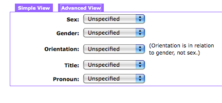
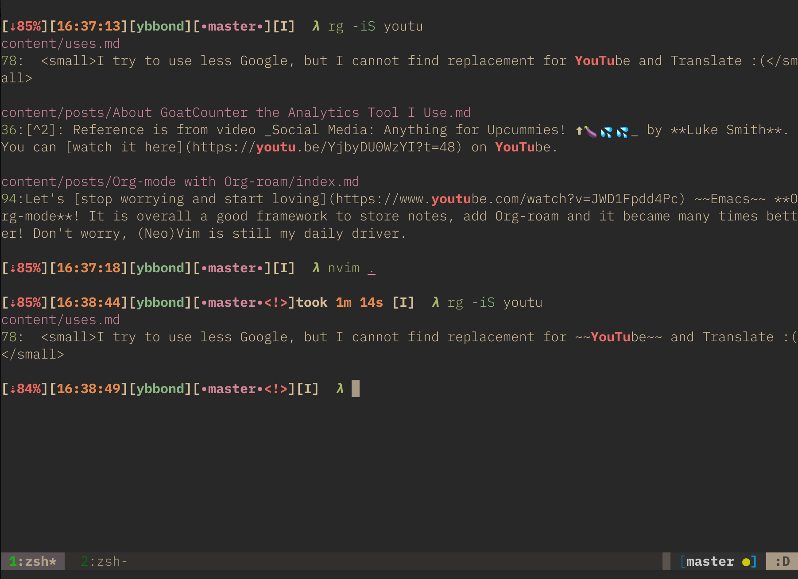
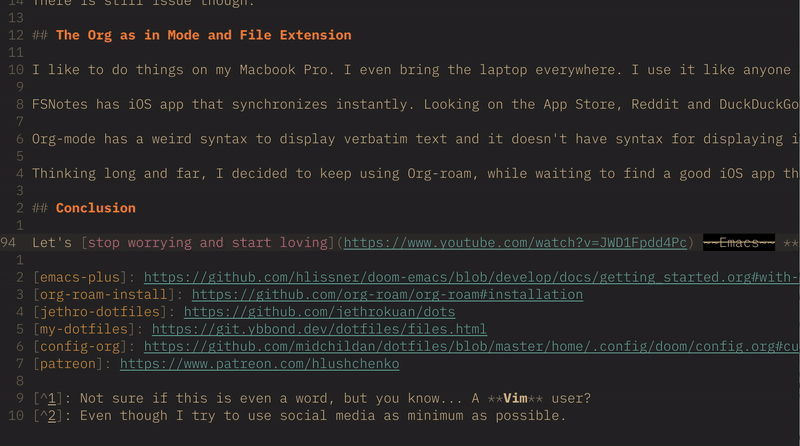
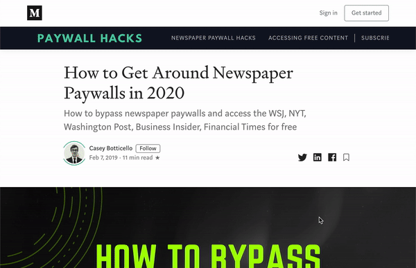

This is a complicated world. Each individuals are different, and there are many factors to consider while interacting with others. People who don't eat pork, or won't eat meat. People who fond of talking about ghost, and the ones easily scared. You must leave the toilet seat closed in some house, in some others opened.

Internet adds to that complexity. For instance you share a cute picture of a snake. There may be someone having _Ophidiophobia_[^1] who will block you. Not because they hate you, but only to get rid of that "horrible picture" of a scary creature.

## On Inclusivity

The awareness of inclusivity had spread wider day by day. There is **Inclusive Design**, which concepts encourage you to think about **diversity** and **accessibility** when building products.

Example of diversity: provide more gender dropdown choice knowing some people won't feel comfortable sharing their gender. Or perhaps, make the gender dropdown choice non-mandatory. Better yet, don't ask for it.

Example of accessibility: make your website content recognizable by text-to-speech software for those having difficulties reading. Other example of accessibility: provide certain color scheme on video game's User Interface, for those having difficulties differentiating certain colors.

## Content Sharing

Back to the topic of content sharing. I gave you example about sharing picture of animal that some people may find disturbing. That is one thing.

Other thing is to think about individuals that do extra effort to conceal their **privacy**, even from Google[^2].

What is it about Google? Well, some people believe that accessing Google's domains or endpoints may give off their privacy to that company. The obvious example is using Google Analytics for any website[^3]. That practice may give off visitors' data to Google. Other example is using Google Fonts, or embedding Youtube videos. Extreme example is linking a text to Youtube, like how I did in some of my posts.

This practice may leads unaware readers to accidentally visit Youtube. They won't like that. I replaced the links to [Invidio.us](https://invidio.us) though. Hope that helps.

So we talked about disturbing content and privacy. I am also thinking about **content availability**. The example is sharing great content that some people may not be able to retrieve, because it is hidden behind paywall. The example is some content on Medium, or NYTimes.

I often encounter this on Hacker News, where the linked content is a paywalled post on Medium, or NYTimes. There is a work-around for this that I often use, because some of those great contents might only be available on that certain paywalled platform.

When sharing contents that I originally read on Medium, I train myself to take some time searching whether that post shared elsewhere and to share the alternative link instead.

## Conclusion

> You cannot please everyone.

The topics I've written are not all. Others may think of other factors they find necessary to consider before writing post or sharing links on the internet.

Easier written than said, even more done.

Sometimes I forget about some factors, and I am willing to be stand corrected for that. Thank you for all of you taking your precious time for reminding me. Truly appreciate your good intention.

As a closing statement: This is a complicated world. I can be a simpleton and ignoring all those complexity, but I choose the option that I think will make this world a more pleasant place to live. For me, and others.

Cheers!

[^1]: Fear of snake. Even they may feel the fear only by reading the word of that animal. Sorry then :(
[^2]: [Don't trust privacy options](https://alirezahayati.com/2020/06/dont-trust-privacy-options/) → **Ali Reza Hayati** boldly written about how some companies may use your private informations for scary things. Not now, maybe, but might be in the future.
[^3]: [A more privacy-friendly blog](https://vincent.bernat.ch/en/blog/2018-more-privacy-blog) → This is a great post by **Vincent Bernat** listing privacy friendly alternatives for tools oft used on website.
