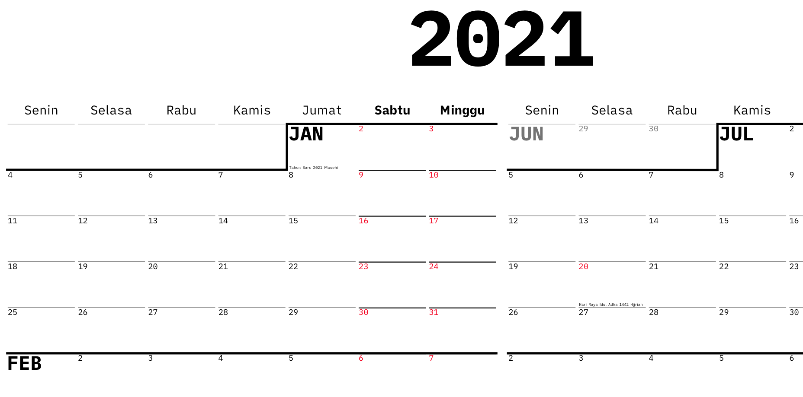

Sudah lama saya tidak mendisain, kebetulan saya beli _Affinity Designer_ saat potongan harga pada periode _Black Friday_ tahun lalu. Sembari belajar lagi, saya coba bikin kalender sekaligus <em>yearly planner</em> untuk tahun 2021.

## Unduh

PDF siap cetak [dapat anda unduh di sini][unduh]. Rekomendasi saya adalah cetak ukuran A1 dengan bahan spanduk lateks agar kalender ini mudah dicoret dan dibersihkan dengan spidol non-permanen.

Sementara hanya ada satu macam disain. Saya akan perbarui artikel ini jika versi lain sesuai masukan dan pemberian suara dari Instagram sudah saya buat.

Umpan balik, saran atau pelaporan kesalahan penulisan dan disain dapat disampaikan ke alamat surel saya di hi@ybbond.dev. Jika anda punya akun Twitter, bisa juga [membalas tweet saya](https://twitter.com/ybbond_/status/1345821961323102208).

## Fitur

**Tidak ada jeda antar bulan** memungkinkan implementasi paradigma _time blocking_ yang luwes.

Hal tersebut juga menekankan bahwa dalam kehidupan yang sibuk ini, unit **pekan** merupakan mata uang yang berharga. Kita hidup merencanakan kegiatan yang harus dilakukan tiap pekan, sembari menanti akhir pekan untuk bersantai.

**Dimensi yang besar** memudahkan anda menulis catatan atau perencanaan kegiatan. Dimensi disain adalah 550x800mm, sedikit lebih kecil dari ukuran A1. Disadur dari ukuran lebar pintu kulkas di rumah saya.

## Sumber Data

Kalender dan _Yearly Planner_ 2021 ini turut mencantumkan Hari Libur Nasional dan jadwal cuti bersama untuk tahun 2021. Saya ambil data tanggal dan deskripsi dari artikel di situs **Kementerian Pendayagunaan Aparatur Negara dan Reformasi Birokrasi**. Berikut tautan menuju artikel di [situs resmi menpan.go.id][menpan], atau ke [cadangan di archive.org][archive-menpan].

Pemilihan singkatan untuk tiap nama bulan saya ambil dari [Wikipedia - Bulan (penanggalan)][wikipedia].

## Font

Font yang saya gunakan adalah `iA Writer Quatro`, font yang dirilis dan digunakan oleh **iA** pada aplikasi mereka [iA Writer](https://ia.net/writer). Font dapat [diunduh dari GitHub][ia-github], dan saya himbau untuk membaca lisensi yang mereka pilih sebelum menggunakan font.

Mereka juga [menerbitkan artikel][ia-post] memberi keterangan mengenai pembuatan font tersebut secara komprehensif (artikel dalam Bahasa Inggris).

[archive-menpan]: https://web.archive.org/web/20210101095722/https://www.menpan.go.id/site/berita-terkini/libur-nasional-dan-cuti-bersama-tahun-2021-sebanyak-23-hari
[ia-github]: https://github.com/iaolo/iA-Fonts
[ia-post]: https://ia.net/writer/blog/a-typographic-christmas
[menpan]: https://www.menpan.go.id/site/berita-terkini/libur-nasional-dan-cuti-bersama-tahun-2021-sebanyak-23-hari
[twitter]: https://twitter.com/markobar1996/status/1344925077523972098
[unduh]: https://cdn.ybbond.dev/static/2021.pdf
[wikipedia]: https://id.wikipedia.org/wiki/Bulan_(penanggalan)
