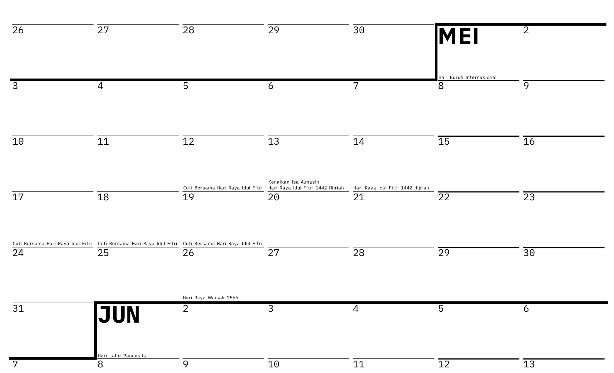
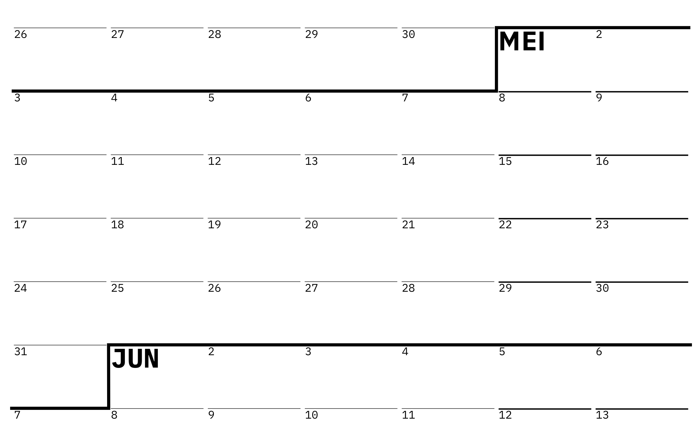
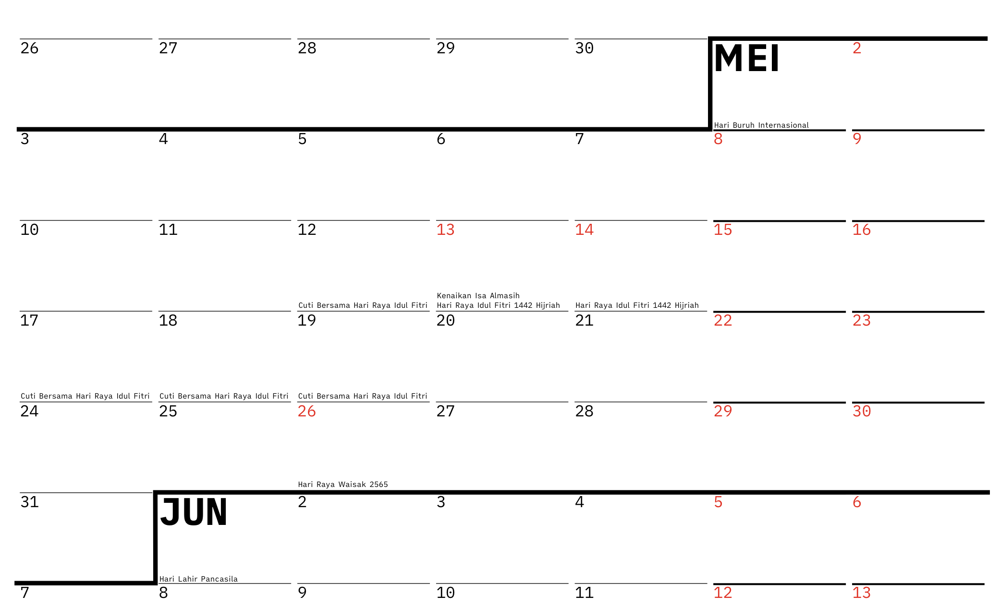
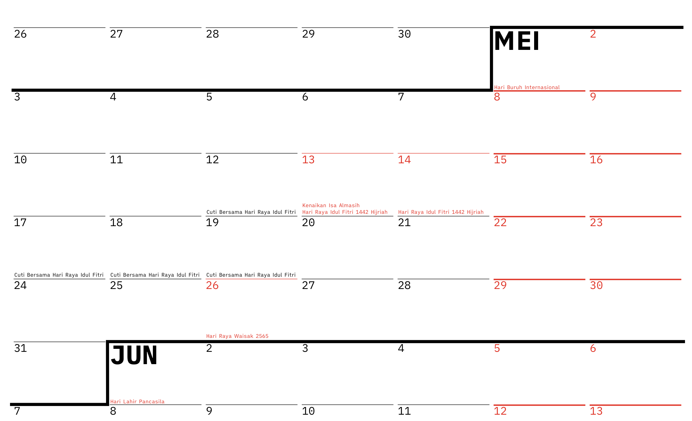
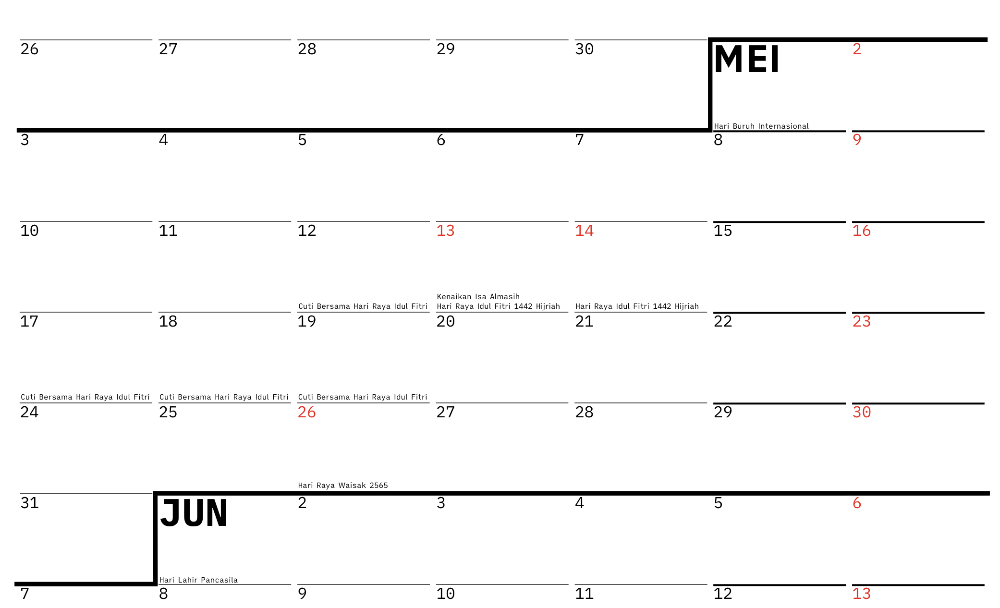
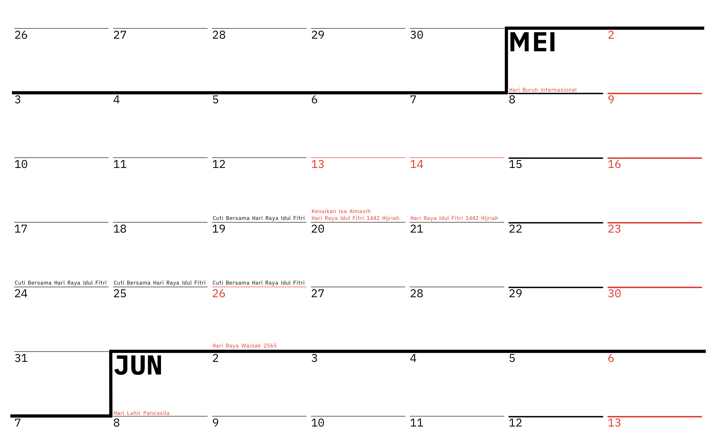

§ [Unduh](#unduh)
&nbsp;&nbsp; »  [Hitam dengan penanda libur](#hitam-dengan-libur)
&nbsp;&nbsp; »  [Hitam **tanpa** penanda libur](#hitam-tanpa-libur)
&nbsp;&nbsp; »  [Angka berwarna merah](#angka-merah-dengan-libur)
&nbsp;&nbsp; »  [Angka dan garis berwarna merah](#angka-garis-merah-dengan-libur)
&nbsp;&nbsp; »  [Sabtu tidak libur, angka berwarna merah](#sabtu-masuk-angka-merah)
&nbsp;&nbsp; »  [Sabtu tidak libur, angka dan garis berwarna merah](#sabtu-masuk-angka-garis-merah)
§ [Fitur](#fitur)
§ [Sumber Data](#sumber-data)
§ [Font](#font)

Sudah lama saya tidak mendesain. Sembari belajar lagi[^aff], saya coba bikin kalender sekaligus <em>yearly planner</em> untuk tahun 2021.

## Unduh

Unduh PDF varian [hanya warna hitam, dengan penanda libur][unduh-hitam-dengan-libur].

Unduh PDF varian [hitam, **tanpa** penanda libur][unduh-hitam-tanpa-libur].

Unduh PDF varian [angka merah][unduh-angka-merah-dengan-libur].

Unduh PDF varian [angka, garis dan penanda libur berwarana merah][unduh-angka-garis-merah-dengan-libur].

Unduh PDF varian [Sabtu tidak libur dan angka merah][unduh-sabtu-masuk-angka-merah].

Unduh PDF varian [Sabtu tidak libur. Angka, garis dan penanda libur berwarana merah][unduh-sabtu-masuk-angka-garis-merah].

Rekomendasi saya adalah cetak ukuran A1 dengan bahan spanduk albatros atau lateks agar kalender ini mudah dan tahan lama.

Umpan balik, saran atau pelaporan kesalahan penulisan dan desain dapat disampaikan ke alamat surel saya di hi@ybbond.dev. Jika anda punya akun Twitter, bisa juga [membalas tweet saya](https://twitter.com/ybbond_/status/1345821961323102208).

## Fitur

**Tidak ada jeda antar bulan** memungkinkan implementasi paradigma _day theming_ atau _calendar blocking_[^paradigm] yang luwes.

Hal tersebut juga menekankan bahwa dalam kehidupan yang sibuk ini, unit **pekan** merupakan mata uang yang berharga. Kita hidup merencanakan kegiatan yang harus dilakukan tiap pekan, sembari menanti akhir pekan untuk bersantai.

**Dimensi yang besar** memudahkan anda menulis catatan atau perencanaan kegiatan. Dimensi desain adalah `550x800mm`, sedikit lebih kecil dari ukuran A1. Disadur dari ukuran lebar pintu kulkas di rumah saya.

## Sumber Data

Kalender dan _Yearly Planner_ 2021 ini turut mencantumkan Hari Libur Nasional dan jadwal cuti bersama untuk tahun 2021. Saya ambil data tanggal dan deskripsi dari artikel di situs **Kementerian Pendayagunaan Aparatur Negara dan Reformasi Birokrasi**. Berikut tautan menuju artikel di [situs menpan.go.id][menpan], atau ke [cadangan archive.org][archive-menpan].

Pemilihan singkatan untuk tiap nama bulan saya ambil dari [Wikipedia - Bulan (penanggalan)][wikipedia].

## Font

Font yang saya gunakan dirilis oleh **iA**[^ia], dengan nama varian `iA Writer Quattro`. Font dapat [diunduh dari GitHub][ia-github], dan saya himbau untuk membaca lisensi yang mereka pilih sebelum menggunakan font.

Mereka juga [menerbitkan artikel][ia-post] memberi keterangan mengenai pembuatan font tersebut secara komprehensif (artikel dalam Bahasa Inggris).

## Penutup

Kalian bisa mendownload file PDF dan mencetak untuk diri kalian sendiri. Mohon tidak mencetak untuk dijual, karena saya pun memakai font gratis non-komersil. Lisensi dan hak milik adalah hal yang baiknya dihormati.
Jika kalian mencetak untuk teman kalian dan minta uang ganti, cukup ongkos cetak dan bensin saja :D

Semoga kalender ini bermanfaat!

[^aff]: Saya menggunakan [Affinity Designer](https://affinity.serif.com/en-us/designer/), yang saya beli saat potongan harga pada periode _Black Friday_ tahun lalu.
[^ia]: Font itu, beserta 2 varian font lain, juga dipakai untuk aplikasi [iA Writer](https://ia.net/writer).
[^paradigm]: Metode merencanakan kegiatan yang bisa jadi berlangsung selama lebih dari sehari. Biasa ditemui di kalender digital, namun bisa juga diterapkan pada kalender fisik. Salah satu artikel (dalam Bahasa Inggris) yang menjelaskan tentang hal ini adalah [How to Calendar Block Your Week](https://www.keepproductive.com/blog/how-to-calendar-block) oleh **KEEP PRODUCTIVE**.

[archive-menpan]: https://web.archive.org/web/20210101095722/https://www.menpan.go.id/site/berita-terkini/libur-nasional-dan-cuti-bersama-tahun-2021-sebanyak-23-hari
[ia-github]: https://github.com/iaolo/iA-Fonts
[ia-post]: https://ia.net/writer/blog/a-typographic-christmas
[menpan]: https://www.menpan.go.id/site/berita-terkini/libur-nasional-dan-cuti-bersama-tahun-2021-sebanyak-23-hari
[twitter]: https://twitter.com/markobar1996/status/1344925077523972098
[unduh]: https://cdn.ybbond.dev/static/2021.pdf
[unduh-hitam-tanpa-libur]: https://cdn.ybbond.dev/static/2021-hitam-tanpa-libur.pdf
[unduh-hitam-dengan-libur]: https://cdn.ybbond.dev/static/2021-hitam-dengan-libur.pdf
[unduh-sabtu-masuk-angka-merah]: https://cdn.ybbond.dev/static/2021-angka-merah-dengan-libur-sabtu-masuk.pdf
[unduh-sabtu-masuk-angka-garis-merah]: https://cdn.ybbond.dev/static/2021-angka-garis-merah-dengan-libur-sabtu-masuk.pdf
[unduh-angka-merah-dengan-libur]: https://cdn.ybbond.dev/static/2021-angka-merah-dengan-libur.pdf
[unduh-angka-garis-merah-dengan-libur]: https://cdn.ybbond.dev/static/2021-angka-garis-merah-dengan-libur.pdf
[wikipedia]: https://id.wikipedia.org/wiki/Bulan_(penanggalan)
