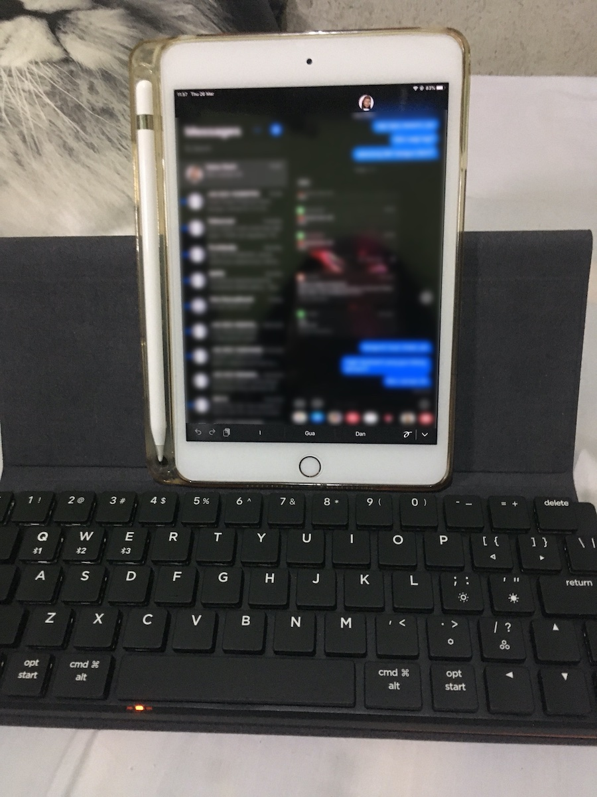
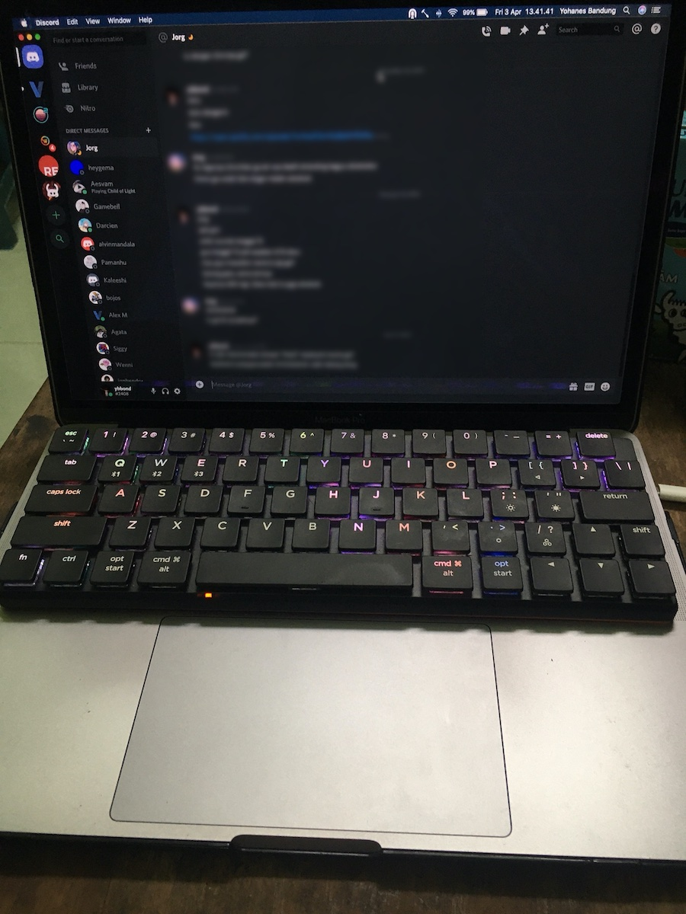

> **Update**
> NuPhy released firmware release for this keyboard that can be downloaded in their website. [Click here for the download page][firmware].
>
> One of the new feature this update enables is option to assign the upper-left most key as grave accent and tilde (<code>\`</code> and `~`).
> That one solves one of my issues described below.

I backed a project in [Kickstarter](https://www.kickstarter.com/projects/nuphy/nutype-revolutionizing-the-laptop-typing-experience) in January 2020. The project planned to create Bluetooth Mechanical keyboard that can be placed on top of Macbook's keyboard. I backed as an **Early Bird** backer, it costs me $89 and _Jenius_ charged me Rp980263. The waiting was interesting and then became worrying when the Covid-19 outbreak happened. I received the keyboard in late March, the DHL guy delivered it to my house and my father sprayed the package with disinfectant immediately.
 
I enjoyed and genuinely happy that I have my first bluetooth mechanical keyboard. If you read my [previous](/posts/2020-03-in-search-of-good-writing-app-bear-vs-ulysses/) blog [posts](/posts/2020-04-in-search-of-good-writing-app-part-2-ia-writer-vs-ivim/), you'd know that I have utilized this keyboard to write blog posts and journal on my iPad.

## Aesthetic and Build

My first Mechanical Keyboard is Ducky One 2 Mini 60%, a gift from my colleagues when I resigned from that office. They know that I never use arrow button, and rarely use mouse. The Ducky is compact enough and bringing it in my commuting from and to office is not a burden. The NuType F1 is even more compact, considering it has physical arrow keys.

I haven't tested bringing it with me anywhere as this is a "Stay At Home" era. Nevertheless, I often bring it with my iPad to any part of my house with no hassle.

Included with the package is the keyboard case, that magnetically sticks to its bottom and the flap folds to cover the entire large side of the keyboard. The foldable flaps can also be shaped as my iPad's stand. I like the case very much, the material feels like _alcantara_ and it looks premium.

The finish of the keyboard is not as good as the case though. The black color feels plastic-y, and the orange color in the bottom does not satisfy my flavor.

The build quality of the keyboard is good as if it can endure a small drop. It weights just right, and it has part of rubber to make it sticks to the glass table of my house's pantry.

The keyboard provides more than 5 RGB backlight variations. I am to lazy to count the exact number. My favorite is the ripple effect. I always choose ripple effect for all my keyboard that supports backlighting.

## Functionality

NuType F1 supports 3 separate bluetooth connections, I tested switching between MacBook, iPad and Phone with very little delay.

Speaking of delay, it is a bit hit and miss. Most of the time, and in most of the part of my house, the bluetooth connection is good and I don't experience any typing delay. Sometimes, I experience a frustrating delay. I don't know if it is when I open a heavy programming app and my laptop has difficulties keeping the bluetooth connection stable. The bluetooth connection also showing problems in one part of my house that the wall is made from steel. That so, I don't know whether it is the device or the keyboard. I have no other bluetooth connected device to test, save for PS4 DualShock 4 controller and a Logitech bluetooth mouse with dongle.

## White Switch

**NuType F1** uses Kaihua Choc switches, and I ordered the white switch, because they claimed it is the most noisy. I like noisy keyboards, the people around me don't.

Typing on this keyboard is overall convenient. If I can compare, trying NuType F1 after Ducky One 2 Mini feels like trying MacBook's butterfly keyboard after the scissor switch. The switches are short in travel, but it feels tactile. The key has flat surface, and sliding my fingers on top of them feels smooth.

Unfortunately this keyboard only use one switch for its space bar. Sometimes I fail to press the `Space` key if I press it at the left or right edge.

> **Update**
> As stated above, new firmware update fixes the issue I wrote below.
> You can [download the binary on their site][firmware]. 

I also complains about the upper-left most key, that is the `Esc` key. The **NuPhy** team made the decision to make the escape as the main key, and you need to press `Fn` with `Esc` to trigger back tick, or `Fn` with `Shift` and `Esc` to trigger tilde `~`. I hardly press escape key. As a JavaScript developer, I press back tick more often for `string literal`. I also need back tick to make `code` text formatting when I write MarkDown or in Slack.

## Overall

This keyboard helped me boost my productivity in two areas. I am able to write on iPad. I can also also type faster on MacBook Pro, which butterfly keys had shown its infamous issue since 3 months ago. I can say that this _kickstarter_ keyboard helps to _kickstart_ my productivity. See what I did there? Kickstart?

[firmware]: https://nuphy.com/pages/firmwares-for-nutype-f1
