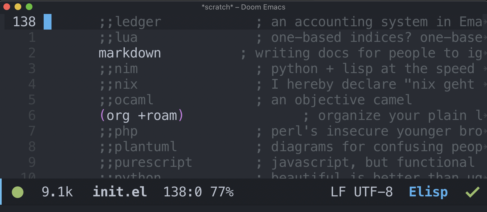
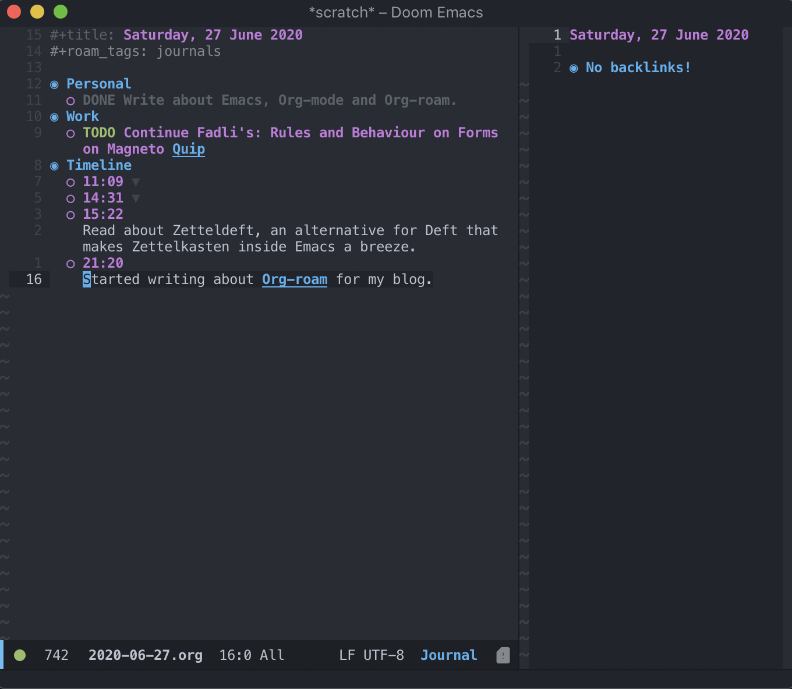
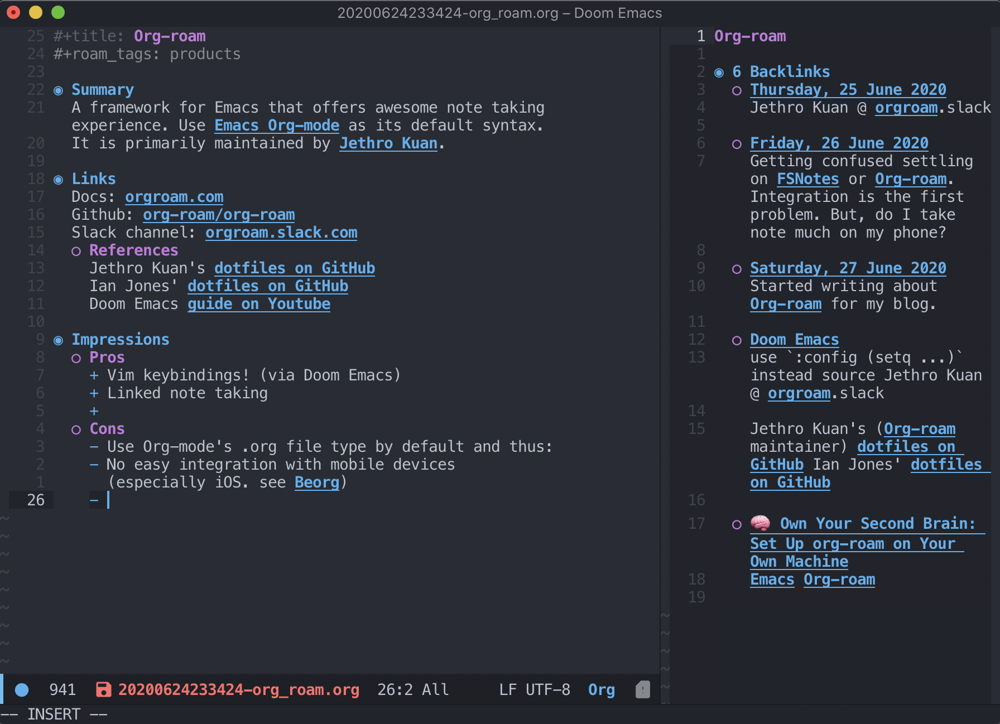
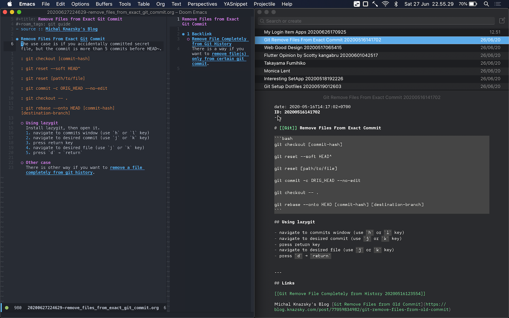

On a late night some twenty or more days ago, my friend [Juang](https://twitter.com/broerjuang "Link to Juang's twitter profile") contacted me on Discord.

> On Wed, Jun 03, 2020 at 01.20 AM @broerjuang wrote:
> Dung
>
> On Wed, Jun 03, 2020 at 01.20 AM @ybbond wrote:
> ju
>
> On Wed, Jun 03, 2020 at 01.20 AM @broerjuang wrote:
> [https://github.com/org-roam/org-roam](https://github.com/org-roam/org-roam)
> lol

He knew about me ranting on Twitter two days earlier for not getting invitation to try **Roam Research**. He is also a fellow _Vimmer_[^1], and I think he knew that I will think twice before using Emacs. I decided to to try it today.

## The Steps

First, I installed Emacs. If you are on macOS, it is [highly recommended][emacs-plus] to use emacs-plus:

```bash
brew tap d12frosted/emacs-plus
```
```bash
brew install emacs-plus --with-modern-icon-cg433n
```
```bash
ln -s /usr/local/opt/emacs-plus/Emacs.app /Applications/Emacs.app
```

Then install Doom Emacs:

```bash
git clone https://github.com/hlissner/doom-emacs ~/.emacs.d
```
```bash
~/.emacs.d/bin/doom install
```

I know from experience that I should try the vanilla version of any software before modding it. For Emacs, I have known its basic navigation key bindings. I even use the basic `C-b`, `C-f`, `C-n`, `C-p`, `C-a` and `C-e` instead of arrow keys to navigate most text editor that don't support Vim key bindings. Even you can use Emacs bindings for the form in the internet with Web Browser. Doom Emacs use Evil mode key bindings by default, that means Vim-like key binding is usable from the start.

I make myself comfortable with Doom Emacs for an hour, then installing Org-roam. With Doom Emacs, Org-mode is installed by default and I can add `+roam` flag in `init.el` to install Org-roam. You can also follow the main installation method from [the docs][org-roam-install].



I also installed the recommended packages `deft` and `org-journal`. The former is a tool to open any file by searching its title or content text. The later is a complementary framework to make a good timeline based journaling _à la_ Roam Research. With the tool ready, I try making a daily journal with the shortcut `C-c` `n` `j`.



## The Matter of Personal Preferences

Evil mode is actually an acronym for _Extensible Vi Layer_. Its key bindings really makes me feel at home, but it still has some quirks. My first problem is with soft wrapped text. I mapped `gj` and `gk` to replace default `j` and `k` in Vim, it enables **per visual line** movement on wrapped text, instead of **per line number**. `evil-mode` provides `evil-respect-visual-line-mode` option, but it doesn't work in the case of delete whole line with `dd` command. With that option enabled, `dd` will only delete the current visual line. I installed [evil-better-visual-line](https://github.com/YourFin/evil-better-visual-line) that try to solve this issue. There is still some quirks, but better than before.

My second problem is clipboard management. I expect a Vim-like environment to not mess with my system clipboard each time I delete, yank or change any text with Vim key bindings. I want the editor to use its internal register for Vim commands, and only use clipboard if I explicitly use `⌘+c` and `⌘+v`. For this issue, I asked on Doom Emacs' discord channel, and got the solution from this [this guide][config-org].

A newbie Emacs user, I configure with Org-roam's maintainer's [dotfiles][jethro-dotfiles] as reference. You can see my Doom Emacs configuration files on my [dotfiles repo][my-dotfiles].

## Moving from FSNotes

I use FSNotes to keep my notes. It is a great program inspired by nvALT and created by a single person (check out the [Patreon page][patreon]!). It features wiki linking and I've tried using Zettelkasten paradigm, even though not too successful. I have 300+ good Markdown files in it, guides, personal notes, quotes from internet, many topics.





My next move after creating journal with Org-roam is... migrating the Markdown files to Org files. I migrated 2 files at first, then compared between my notes on Org-roam with the one in FSNotes. I actually liked the interface of FSNotes, but the automatic back links, and the Vim bindings... I went "what the hell" and migrated all of those 300+ Markdown files. It took around 2 hours of my afternoon, but I enjoy it.

There is still issue though.

## The Org as in Mode and File Extension

I like to do things on my Macbook Pro. I even bring the laptop everywhere. I use it like anyone else use smartphone, as communication tool, scrolling social medias[^2], read articles and news. But I'd still like to be able to see my notes on my iPhone or iPad, and this weird *.org file format hindered me on doing so.

FSNotes has iOS app that synchronizes instantly. Looking on the App Store, Reddit and DuckDuckGo, I only find this app called [Beorg](https://beorgapp.com/). By itself, Beorg is a good TODO and Agenda manager based on Org-mode. It won't accept *.org file outside its iCloud directory, so no go. Other alternative is to install terminal emulator app and Emacs within, but it won't be a pleasant touch experience.

Org-mode has a weird syntax to display verbatim text and it doesn't have syntax for displaying inline code or block code. As a programmer that often store note related to coding, I think this is a minus.

Thinking long and far, I decided to keep using Org-roam, while waiting to find a good iOS app that allow me to read my notes. Maybe it's time to make my own iOS application that does just that? Interesting.

## Conclusion

Let's [stop worrying and start loving](https://invidio.us/watch?v=JWD1Fpdd4Pc) ~~Emacs~~ **Org-mode**! It is overall a good framework to store notes, add Org-roam and it became many times better! Don't worry, (Neo)Vim is still my daily driver.

[emacs-plus]: https://github.com/hlissner/doom-emacs/blob/develop/docs/getting_started.org#with-homebrew
[org-roam-install]: https://github.com/org-roam/org-roam#installation
[jethro-dotfiles]: https://github.com/jethrokuan/dots
[my-dotfiles]: https://git.ybbond.dev/dotfiles/files.html
[config-org]: https://github.com/midchildan/dotfiles/blob/master/home/.config/doom/config.org#cutting-and-pasting
[patreon]: https://www.patreon.com/hlushchenko

[^1]: Not sure if this is even a word, but you know... A **Vim** user?
[^2]: Even though I try to use social media as minimum as possible.
