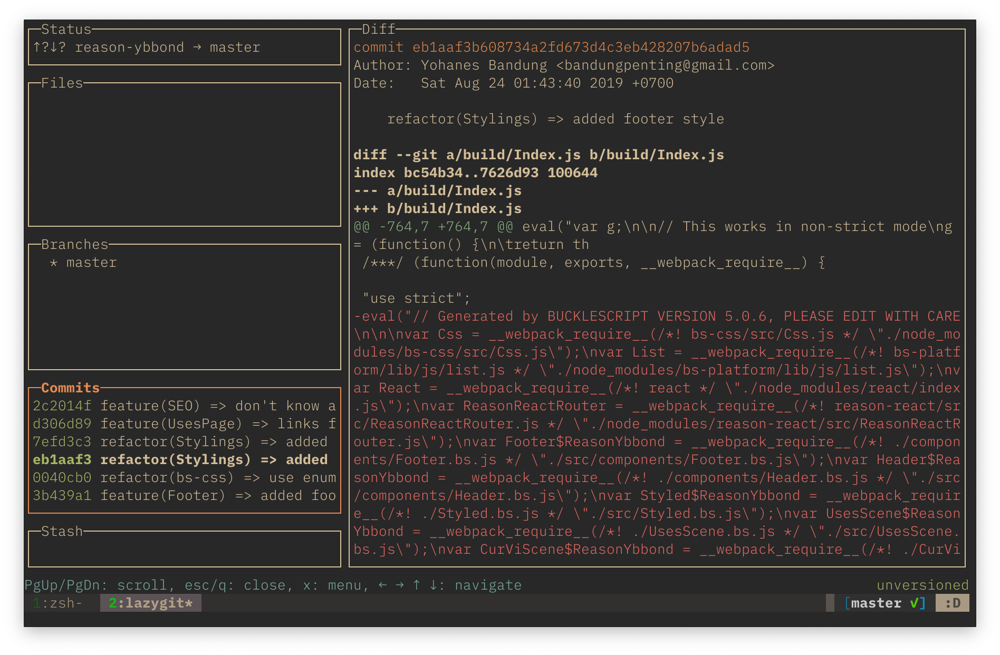
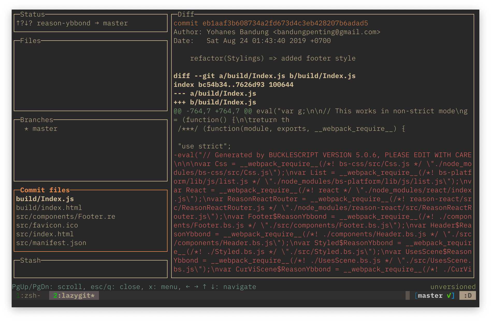

tldr; [Skip to solution »](#how-tos)

Last week, I encountered a merge conflict while trying to sync my git working branch to latest remote `master`. Merge conflicts is not a serious problem to me, I am used to resolving conflicts. But the conflict that I encountered is from an auto generated typings file from `Apollo Codegen`[^1].

`Apollo Codegen` file is `Flow` or `TypeScript` typings for the schema and queries in project that uses GraphQL. The generated file often has >10k lines of code. Trying to resolve conflict in that file will make the text editor unresponsive (even with Vim!).

So I aborted the sync master (`git rebase --abort`), then attempt to remove the changes for the auto-generated codegen file [using lazygit](#lazygit-way). Afterwards, I do sync remote `master` branch and the conflict don't happen. Last thing I do is regenerate the codegen file before posting a Pull Request.

## How-Tos

Back to the post's main topic, to remove specific file using plain old shell command.

First, checkout to **temporary branch** with the afore mentioned commit as `HEAD` using the commit's hash:

```bash
git checkout <commit-hash>
```

Then do a **soft reset** to uncommit with all files in staged status:

```bash
git reset --soft HEAD^
```

Make the desired file(s) unstaged using **reset** command, and then commit with `-c ORIG_HEAD` flag to use the previous commit message. The `--no-edit` flag is optional.

```bash
git reset <path/to/file>
```
```bash
git commit -c ORIG_HEAD --no-edit
```

Discard the changes of the file you want to remove from unstaged area:

```bash
git checkout -- .
```

Last, `rebase` this **temporary branch** to your branch, from the commit of `<commit-hash>`.

```bash
git rebase --onto HEAD <commit-hash> <destination-branch-name>
```

If you do this for already merged Pull Request, you need to `push <remote> <branch> --force`. Mind you, doing this will be inconvenient for other people working on same project.

## Lazygit Way

As I mentioned above, I use [lazygit](https://github.com/jesseduffield/lazygit). The process is more straight forward. For the following example, I accidentally committed build file, far before I `.gitignore`d `build/` folder. What I do is:






Do this way if you want to install lazygit before doing your intention.

`lazygit` way is easier. I also use [tig](https://github.com/jonas/tig) as a TUI for `git`, but I don't know the command to do the steps wit `tig`.

[^1]: Here is `Apollo Codegen` [Github](https://github.com/apollographql/apollo-tooling#apollo-clientcodegen-output) page. As a frontend engineer, I consider `codegen` as breakthrough because I can easily type the endpoint's return value.
